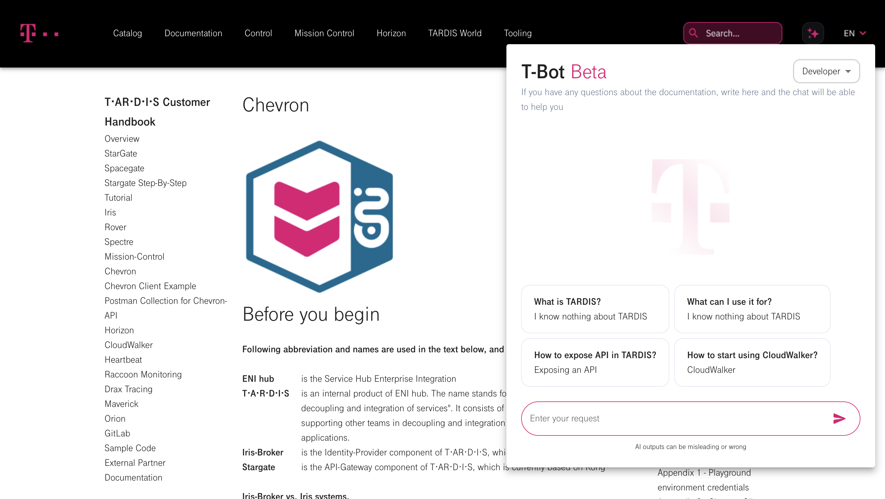

# TARDIS CHALLANGE

### Backend part

The project involves the creation of an innovative chatbot that will be integrated directly into the developer's website,  
providing users with the convenience and speed of information exchange. The core of this chatbot is based on the powerful `GPT API` language model,
which analyzes all customer project documentation and answers users' questions,  
providing them with informative answers.  
Interaction with the language model takes place through a convenient pop-up window that is localized directly on the company's website to ensure maximum accessibility and efficiency of interaction for users.

### Front-end part
